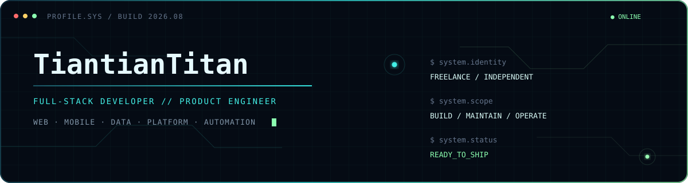

<div align="center">
  

  <a href="#english"></a>
  <a href="#language-versions"></a>
  <a href="#language-versions"></a>

  <br />

  
</div>

<a id="english"></a>

## `01 // PROFILE`

```yaml
identity:  TiantianTitan
role:      Freelance Full-Stack Developer
scope:     [Product Development, Software Engineering, Code Maintenance]
systems:   [Databases, Platform Operations, Web, Mobile]
mode:      Build → Ship → Observe → Improve
```

I am a freelance full-stack developer who builds and maintains software across the full product lifecycle—from translating real-world needs into working features to keeping databases, platforms, and production systems healthy. I care about maintainable code, dependable delivery, and products that become better with every iteration.

- `PRODUCT` — turning requirements into clear, usable experiences
- `ENGINEERING` — full-stack implementation across web, mobile, data, and integrations
- `RELIABILITY` — code maintenance, database stewardship, platform operations, and continuous improvement
- `EXPLORATION` — AI-assisted workflows, automation, and more expressive human–computer interaction

## `02 // FEATURED PROJECT`

<h3 align="center">
  <a href="https://github.com/TiantianTitan/codex-anime-pets">CODEX ANIME PETS</a>
  <code>ANIMATION SYSTEM</code>
</h3>

<p align="center">
  A production pipeline that turns character art into installable Codex v2 animated desktop companions.<br />
  <code>9 animation states</code> · <code>16 gaze directions</code> · <code>2D + 3D styles</code> · <code>deterministic atlas assembly</code> · <code>visual QA</code>
</p>

<table align="center">
  <tr>
    <td align="center"></td>
    <td align="center"></td>
    <td align="center"></td>
    <td align="center"></td>
    <td align="center"></td>
  </tr>
</table>

<p align="center">
  <a href="https://github.com/TiantianTitan/codex-anime-pets"><strong>ACCESS REPOSITORY →</strong></a>
</p>

## `03 // SYSTEM STACK`

```text
┌─ APPLICATION LAYER
├── Web ........ TypeScript · React · Next.js · Tailwind CSS · Ant Design
├── Mobile ..... React Native · Expo · Capacitor
├── Data ....... PostgreSQL · Prisma · Supabase · Redis
├── Creative ... Unity · C# · Python · Animation Pipelines
└── Delivery ... Turborepo · Playwright · GitHub Actions · AWS · Vercel · Cloudflare
```

<div align="center">
  
</div>

## `04 // SELECTED WORK`

<table>
  <tr>
    <td width="50%" valign="top">
      <h3><a href="https://github.com/friemidev/friemi">FRIEMI ↗</a></h3>
      <p>A multilingual activity discovery and meetup platform for life abroad—connecting city events, group plans, messaging, social footprints, and offline game tools.</p>
      <p><code>TypeScript</code> <code>Next.js</code> <code>Prisma</code> <code>Supabase</code> <code>Redis</code></p>
    </td>
    <td width="50%" valign="top">
      <h3>OLD-6 <sub>PRIVATE SYSTEM</sub></h3>
      <p>A multi-platform service ecosystem for the Chinese community in France, spanning local businesses, bookings, content, community features, and platform operations.</p>
      <p><code>Next.js</code> <code>React Native</code> <code>Expo</code> <code>PostgreSQL</code> <code>Cloudflare</code></p>
    </td>
  </tr>
  <tr>
    <td width="50%" valign="top">
      <h3><a href="https://github.com/dandelion-technologie/yi-credit">YI CREDIT ↗</a></h3>
      <p>A multilingual platform for credit and financing advisory services in France, supporting content delivery, document workflows, and digital operations.</p>
      <p><code>Next.js</code> <code>Expo</code> <code>Prisma</code> <code>AWS S3</code> <code>OpenAI</code></p>
    </td>
    <td width="50%" valign="top">
      <h3><a href="https://github.com/TiantianTitan/IDLE-SHOP">POCKET SHOP ↗</a></h3>
      <p>A multilingual Unity 2D idle shop game for Android with automated customers, inventory, staff progression, local saves, and offline earnings.</p>
      <p><code>Unity</code> <code>C#</code> <code>Android</code> <code>Localization</code></p>
    </td>
  </tr>
</table>

## `05 // OFFLINE MODE`

<p align="center">
  <code>🎤 KARAOKE</code>&nbsp;&nbsp;
  <code>🏓 TABLE TENNIS</code>&nbsp;&nbsp;
  <code>🎬 CINEMA</code>&nbsp;&nbsp;
  <code>🥾 HIKING</code>&nbsp;&nbsp;
  <code>📚 READING</code>
</p>

---

<a id="language-versions"></a>

<details>
<summary><strong>中文 · Chinese</strong></summary>

<a id="中文--chinese"></a>

### `个人简介`

我是一名**自由职业全栈开发者**，承接项目开发、软件开发与交付、代码维护、数据库管理和平台运维。我喜欢从真实需求出发，把想法变成可上线、可维护、能够持续演进的产品。

- 覆盖 Web、移动端、数据库、系统集成与平台维护
- 重视代码可维护性、稳定交付和长期产品演进
- 拥有多语言、海外生活服务、金融服务与跨端产品经验
- 持续探索 AI 工具、自动化工作流和人机交互

### `主要项目`

- **Codex Anime Pets**：将角色素材转化为 Codex v2 动画桌面伙伴的完整制作与质量验证流程
- **Friemi**：面向海外生活场景的多语言活动发现、组局与轻社交平台
- **Old-6**：服务法国华人社区，覆盖本地商家、预约、内容和社区功能的多端平台
- **YI Credit · 易信贷**：面向法国贷款与融资咨询场景的多语言数字平台
- **口袋小店**：支持多语言、本地存档和离线收益的 Unity 2D Android 挂机经营游戏

### `工作之外`

唱 K · 乒乓球 · 看电影 · 徒步 · 阅读

</details>

<details>
<summary><strong>Français · French</strong></summary>

<a id="français--french"></a>

### `Profil`

Je travaille en freelance comme développeur full-stack. Je prends en charge le développement et la livraison de projets logiciels, la maintenance du code, la gestion des bases de données ainsi que l'exploitation des plateformes. J'aime transformer des besoins concrets en produits fiables, maintenables et capables d'évoluer dans le temps.

- Développement Web et mobile, bases de données, intégrations et maintenance de plateformes
- Attention portée à la qualité du code, à la fiabilité des livraisons et à l'évolution durable des produits
- Expérience de produits multilingues et multiplateformes dans les services de proximité et la finance
- Exploration des outils d'IA, de l'automatisation et de nouvelles formes d'interaction humain-machine

### `Projets principaux`

- **Codex Anime Pets** : une chaîne complète de création et de contrôle qualité pour transformer des personnages en compagnons animés Codex v2
- **Friemi** : une plateforme multilingue de découverte d'activités, d'organisation de sorties et de lien social pour la vie à l'étranger
- **Old-6** : une plateforme multiservice destinée à la communauté chinoise en France
- **YI Credit** : une plateforme multilingue de conseil en crédit et en financement en France
- **Pocket Shop** : un jeu de gestion idle 2D sous Unity pour Android, multilingue et jouable hors ligne

### `En dehors du code`

Karaoké · Tennis de table · Cinéma · Randonnée · Lecture

</details>

## `06 // ACTIVITY TELEMETRY`

<div align="center">
  
</div>

<div align="center">
  
  
</div>

<p align="center">
  <code>SYSTEM ONLINE</code> · <code>KEEP BUILDING</code> · <code>KEEP SHIPPING</code>
</p>
